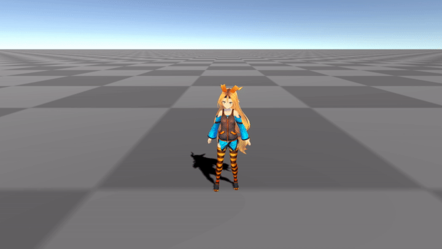

# simple-unitychan-movement

ユニティちゃんを使った移動サンプルです。キーボード、または、ゲームコントローラーで移動やジャンプをします。アニメーション制御には [Playable API](https://docs.unity3d.com/ja/2019.4/Manual/Playables.html) を使用しました。

## 開発環境

macOS Big Sur 11.2.3

Unity 2020.2.2f1

## 操作

### キーボード

|内容|割り当てキー|
| ---- | ---- |
|前へ移動|W|
|後ろへ移動|S|
|右へ移動|D|
|左へ移動|A|
|カメラを右に旋回|→|
|カメラを左に旋回|←|
|ジャンプ|スペース|

### ゲームコントローラー(PS4)
|内容|割り当てボタン|
| ---- | ---- |
|前へ移動|左スティック(前に倒す)|
|後ろへ移動|左スティック(後ろに倒す)|
|右へ移動|左スティック(右に倒す)|
|左へ移動|左スティック(左に倒す)|
|カメラを右に旋回|右スティック(右に倒す)|
|カメラを左に旋回|右スティック(左に倒す)|
|ジャンプ|△|

## 実行画面

## 解説
- [移動処理のアニメーション制御に Playable API を使う – その1](https://heratta-lab.com/unitychan-movement-by-playable-api-1)
- [移動処理のアニメーション制御に Playable API を使う – その2](https://heratta-lab.com/unitychan-movement-by-playable-api-2)
- [移動処理のアニメーション制御に Playable API を使う – その3](https://heratta-lab.com/unitychan-movement-by-playable-api-3)
- [移動処理のアニメーション制御に Playable API を使う – その4](https://heratta-lab.com/unitychan-movement-by-playable-api-4)
- [移動処理のアニメーション制御に Playable API を使う – その5](https://heratta-lab.com/unitychan-movement-by-playable-api-5)
- [移動処理のアニメーション制御に Playable API を使う – その6](https://heratta-lab.com/unitychan-movement-by-playable-api-6)